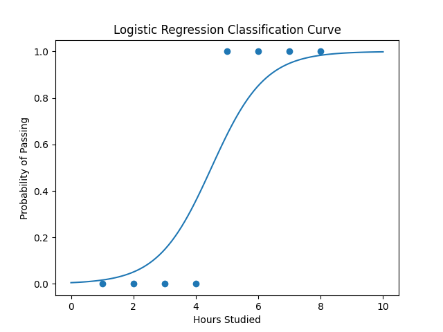

# Day 36 – Logistic Regression (Classification)

## Overview
This project demonstrates the basic concept of **Logistic Regression**, a widely used machine learning algorithm for **classification problems**.

Logistic Regression predicts the **probability of a class label** rather than a continuous value. The output is typically **0 or 1**, representing two classes.

Example problems:
- Pass / Fail prediction
- Spam / Not Spam detection
- Fraud / Legitimate transaction
- Disease prediction

---

## Classification Intuition

In classification problems, the goal is to assign input data to a specific category.

Example dataset:

| Hours Studied | Result |
|---------------|--------|
| 1 | Fail |
| 2 | Fail |
| 3 | Fail |
| 4 | Fail |
| 5 | Pass |
| 6 | Pass |
| 7 | Pass |
| 8 | Pass |

A normal linear regression model may produce outputs greater than **1** or less than **0**, which are not valid probabilities.

To solve this problem, Logistic Regression uses a **Sigmoid Function** that maps any real number to a value between **0 and 1**.

---

## Sigmoid Function

The sigmoid function is defined as:

σ(z) = 1 / (1 + e^(-z))

Where:

z = b0 + b1x

This function converts the linear equation into a **probability value**.

Decision rule:
- If probability ≥ 0.5 → Class 1
- If probability < 0.5 → Class 0

---

## Steps Performed in the Code

1. Create a simple dataset (Hours studied vs Pass/Fail)
2. Split the dataset into training and testing sets
3. Train the Logistic Regression model
4. Predict results using the trained model
5. Evaluate model accuracy
6. Plot the logistic regression curve

---

## Libraries Used

- NumPy
- Matplotlib
- Scikit-learn

Install dependencies:

```
pip install numpy matplotlib scikit-learn
```

---

## Output

The program displays:

- Predictions
- Accuracy score
- Confusion matrix

It also generates a visualization file:

```
logistic_regression_visualization.png
```

---

## Visualization



---

## Applications of Logistic Regression

1. Email spam detection
2. Medical diagnosis
3. Credit card fraud detection
4. Customer churn prediction
5. Marketing response prediction

---

## Key Takeaways

- Logistic Regression is used for **classification problems**
- It predicts **probabilities**
- Uses the **sigmoid function**
- One of the most important **baseline machine learning models**
